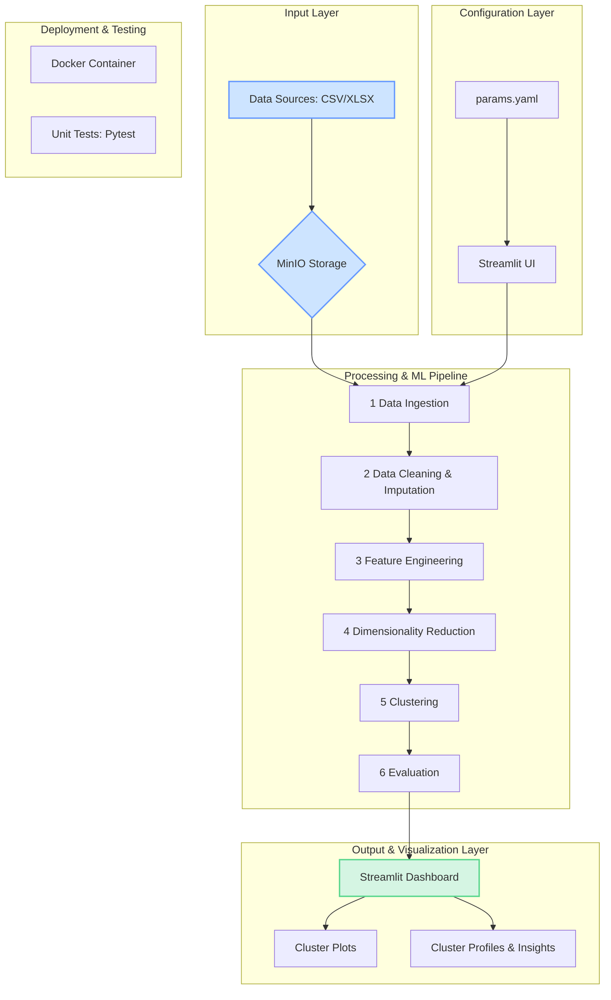

# Customer Clustering Engine

An end-to-end, production-ready ML pipeline for clustering customer survey data. This project automates the repetitive task of segmenting respondents by providing a configurable, containerized, and user-friendly web interface.

## Features

- **End-to-End ML Pipeline**: Automates data ingestion, cleaning, feature engineering, clustering, and visualization.
- **Configurable & Parametric**: All pipeline steps are controlled via a central `params.yaml` file.
- **Interactive UI**: A Streamlit web application allows non-technical stakeholders to run the pipeline and adjust parameters on the fly.
- **Production-Ready**: The entire application stack is containerized with Docker and orchestrated with Docker Compose.
- **Cloud Storage Integration**: Uses MinIO (S3-compatible) for scalable and decoupled data storage.
- **Tested & Reliable**: Includes a suite of unit tests built with `pytest`.

---

## Architecture

The solution is designed with a modular, service-oriented architecture to ensure scalability and maintainability.



---

## Codebase Overview

The project is structured into several key modules, each responsible for a specific part of the pipeline.

-   `app.py`: The entry point for the Streamlit web application. It builds the UI, handles user input, and orchestrates the pipeline execution.
-   `main.py`: A script to run the pipeline from the command line, without the UI.
-   `config/`: Contains the `params.yaml` file, which holds all the configurable parameters for the pipeline.
-   `storage/`:
    -   `minio_client.py`: Manages the connection to the MinIO object storage, handling file downloads and listings.
-   `ingestion/`:
    -   `ingest.py`: Responsible for loading the initial dataset from storage into a pandas DataFrame.
-   `processing/`:
    -   `clean.py`: Handles data cleaning tasks like removing empty columns and imputing missing values (`NaNs`).
    -   `feature_engineering.py`: Creates, selects, or transforms features. Includes logic for grouping related survey questions and applying variance thresholds.
    -   `dimensionality_reduction.py`: Reduces the feature space using methods like PCA or UMAP to prepare data for clustering.
-   `clustering/`:
    -   `cluster.py`: Applies the selected clustering algorithm (e.g., K-Means) to the processed data.
    -   `evaluate.py`: Calculates clustering performance metrics, such as the Silhouette Score.
-   `visualization/`:
    -   `cluster_viz.py`: Generates plots and visualizations of the clusters, such as scatter plots and dendrograms.
-   `tests/`: Contains all unit tests (`test_*.py`) for the project, ensuring code reliability and correctness.
-   `Dockerfile` & `docker-compose.yml`: Define the containerized environment, services (Streamlit, MinIO), and their orchestration.

---

## Getting Started

### Prerequisites

- [Docker](https://docs.docker.com/get-docker/)
- [Docker Compose](https://docs.docker.com/compose/install/)
- Python 3.9+
- An environment manager like `conda` or `venv` (recommended).

### Setup & Installation

1.  **Clone the Repository**
    ```bash
    git clone <your-repo-url>
    cd customer-clustering-engine
    ```

2.  **Set Up a Python Environment**
    ```bash
    # Using conda
    conda create -n clustering python=3.9
    conda activate clustering

    # Or using venv
    python -m venv venv
    source venv/bin/activate
    ```

3.  **Install Dependencies**
    ```bash
    pip install -r requirements.txt
    ```

4.  **Place Your Dataset in MinIO**
    The pipeline is configured to read from a MinIO bucket. The initial setup job (`minio-setup` in `docker-compose.yml`) automatically creates the `survey-dataset` bucket and uploads the sample `dataset.xlsx` file to it.

    If you want to use your own data, you can place it in the `./data` directory before starting the services.

---

## How to Run

You can run the project in two ways: via the interactive Streamlit UI or directly from the command line.

**Note**: This guide assumes you have Docker and Docker Compose installed.

**Whatever method you choose, dont forget to add the xlsx file in the minio bucket (bucket: survey-dataset as per config).**

### 1. Running with the Streamlit UI (Recommended)

This is the primary way to use the application. It starts all necessary services, including the MinIO storage backend and the web interface.

1.  **Start the Services**
    Run the following command from the project root. You may need `sudo` depending on your Docker installation.
    ```bash
    docker-compose up -d --build
    ```

2.  **Access the UI**
    Open your web browser and navigate to:
    - **Streamlit App**: [http://localhost:8501](http://localhost:8501)
    - **MinIO Console**: [http://localhost:9001](http://localhost:9001) (Credentials: `minioadmin`/`minioadmin`)

3.  **Run the Pipeline**
    - Use the sidebar in the Streamlit UI to configure the pipeline parameters.
    - Click the "Run Pipeline" button to see the results.

### 2. Running from the Command Line

This method is useful for development or running the pipeline as a simple script without the UI.

1.  **Ensure Services are Running**
    You still need the MinIO service running in the background.
    ```bash
    docker-compose up -d minio
    ```

2.  **Execute the Main Script**
    Run the pipeline using the default configuration.
    ```bash
    python main.py
    ```

---

## Configuration

The pipeline's behavior is controlled by `config/params.yaml`. Here is a breakdown of the key sections:

-   `storage`: Defines the MinIO bucket, object name (filename), and local path for downloading data.
-   `cleaning`: Controls data cleaning steps.
    -   `imputation_method`: `fill` (with a static value) or `mode` (most frequent value).
    -   `drop_thresh`: Drops columns with a high percentage of missing values.
-   `features`: Manages feature engineering.
    -   `use_variance_threshold`: If `true`, removes zero-variance features.
-   `reduction`: Configures dimensionality reduction (e.g., `pca` or `umap`).
-   `clustering`: Sets the clustering algorithm (`kmeans` or `agglomerative`) and the number of clusters.

You can modify these values in the `config/params.yaml` file to customize the pipeline's behavior.
This configuration style helps the pipeline be easily extensible and maintainable.

---

## Testing

The project includes a suite of unit tests. To run them, first install the development dependencies:

```bash
pip install pytest
```

Then, run the test suite from the project root:

```bash
pytest
